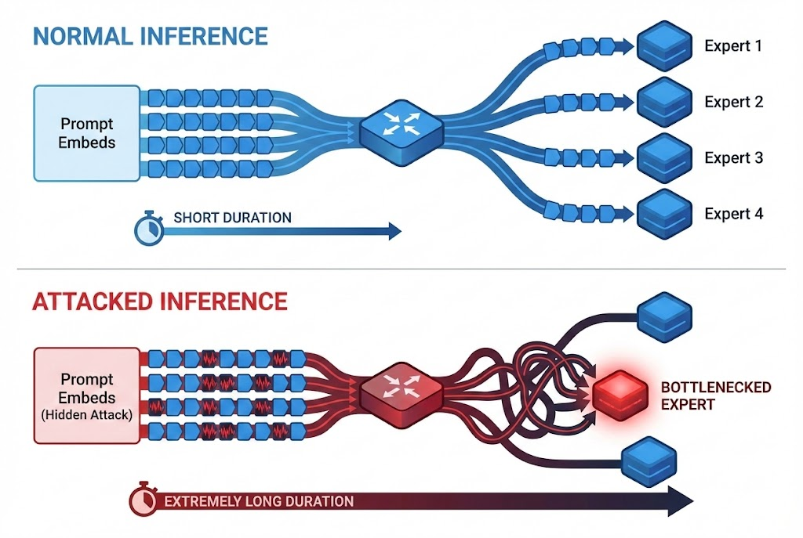

<h2 align="center"> 
  Icarus's Wings: Disabling MoE Offloading Acceleration via a Universal Hidden Prefix Attack
</a>
</h2>
<h5 align="center"> 
Accepted to 2026 63nd ACM/IEEE Design Automation Conference (DAC)  </h5>
<h5 align="center">
```
<p align="center">
  
</p>
```


## 📕 Off-The-Shelf Testing
> A Hugging Face demo is available for quick experience: 
>
> https://huggingface.co/spaces/dac-demo/MoEOffloading


Related code packed in Docker image will be released soon.

